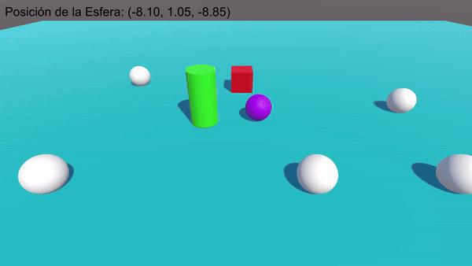

# Interfaces Inteligentes P02
## Ejercicio 1: ColorChanger
Primero inicializamos las variables de la clase

***Nota:*** si es `public` se puede acceder a él desde el inspector. Si es `private`, no.
```cs
public class ColorChanger : MonoBehaviour {
  private Color color;
  public int frameDelay = 120;
  private int frameCounter;
```
- `color` almacena el color actual que se aplicará al objeto
- `frameDelay` es el tiempo en frames que debe pasar antes de cambiar el color del objeto
- `frameCounter` es el contador que se incrementa en cada frame para llevar un control del tiempo
```cs
  void Start() {
    ChangeRandomColor();
    ApplyColor();
  }
```
1. Primero cambia a un color aleatorio desde el inicio
2. Aplica el color recién generado al objeto
```cs
  void Update() {
    frameCounter++;
    if (frameCounter >= frameDelay) {
      frameCounter = 0;
      ChangeRandomColor();
      ApplyColor();
    }
  }
```
1. Se incrementa el contador de frames
2. Verifica si ha pasado el tiempo suficiente
3. Si es así, se reinicia el contador, se genera un color nuevo aleatorio y se aplica al objeto
```cs
  void ChangeRandomColor() {
    color = new Color(Random.value, Random.value, Random.value, Random.value);
  }
```
Genera un color aleatorio usando `Random.value`, que devuelve un valor entre 0 y 1 para cada componente del color (rojo, verde, azul, alfa)
```cs
  void ApplyColor() {
    Renderer renderer = GetComponent<Renderer>();
    if (renderer != null) {
      renderer.material.color = color;
    }
  }
}
```
1. Obtiene el componente `Renderer` del objeto al que está adunto el script
2. Si existe, se aplica el color generado
   

## Ejercicio 2
1. Primero se crean los objetos desde el `Hierarchy`
2. Se crean los materiales en `Assets/Materials`
3. En los ajustes del material, en `Albedo`, se escoge el color
4. Al seleccionar el objeto, en `Mesh Renderer > Materials`, arrastramos el material para asignarlo
```cs
void Start() {
  Debug.Log(gameObject.name);
}
```
Para mostrar los nombres de los objetos, simplemente se usa el `Debug.Log`


## Ejercicio 3
```cs
public class VectorInfo : MonoBehaviour {
  public Vector3 vector_1, vector_2;
  public float magnitud_1, magnitud_2;
  public float angulo;
  public float distancia;
  public string vector_mayor_altura;
```
- `vector_1, vector_2` son vectores que se pueden configurar desde el inspector
- `magnitud_1, magnitud_2` almacenan las magnitudes de ambos vectores respectivamente
- `angulo` almacena el ángulo entre los dos vectores
- `distancia` almacena la distancia entre ambos vectores
- `vector_mayor_altura`guarda un mensaje indicando cuál vector está a mayor altura
```cs
  void Start() {
    magnitud_1 = vector_1.magnitude;
    magnitud_2 = vector_2.magnitude;

    angulo = Vector3.Angle(vector_1, vector_2);
    distancia = Vector3.Distance(vector_1, vector_2);

    if (vector_1.y > vector_2.y) {
      vector_mayor_altura = "Vector 1 está a mayor altura";
    } else if (vector_1.y < vector_2.y) {
      vector_mayor_altura = "Vector 1 está a mayor altura";
    } else {
      vector_mayor_altura = "Ambos vectores están a la misma altura";
    }

    Debug.Log("Magnitud del vector 1: " + magnitud_1);
    Debug.Log("Magnitud del vector 2: " + magnitud_2);
    Debug.Log("Ángulo entre los vectores: " + angulo + " grados");
    Debug.Log("Distancia entre los vectores: " + distancia);
    Debug.Log(vector_mayor_altura);
  }
```
1. Se asignan las magnitudes de los vectores
2. Se calcula el ángulo entre los vectores con `Vector3.Angle`
3. Se calcula la distancia entre los vectores con `Vector3.Distance`
4. Se comprueban los componentes `y` de ambos vectores y se indica cuál está a mayor altura. También puede indicar que tienen la misma altura
5. Se muestran todos los resultados


## Ejercicio 4
```cs
public class ShowPosition : MonoBehaviour {
  private Vector3 posicion;
  private GUIStyle estiloTexto;
```
- `posicion` se almacena la posición actual del objeto
- `estilotexto` define el estilo del texto que aparecerá en pantalla
```cs
void Start() {
  estiloTexto = new GUIStyle();
  estiloTexto.normal.textColor = Color.black;
  estiloTexto.fontSize = 50;
}
```
Se crea una nueva instancia de `GUIStyle`, se establece el color del texto en negro y el tamaño de la letra a 50
```cs
void Update() {
  posicion = transform.position;
}
```
En cada fotograma se comprueba y actualiza la posición, pos si se mueve
```cs
void OnGUI() {
  GUI.Label(new Rect(20, 20, 300, 40), "Posición de la Esfera: " + posicion, estiloTexto);
}
```
Dibuja en la pantalla la posición de la esfera. *Rect(PosX, PosY, ancho, alto)*


## Ejercicio 5
***Nota:*** El script está adjunto a las esfera
```cs
public class ObjDistances : MonoBehaviour {
  private GameObject cubo;
  private GameObject cilindro;
  private Transform transformCubo, transformCilindro, transformEsfera;
```
- `cubo` y `cilindro` son variables que almacenan las referencias a los objetos cubo y cilindro de la escena
- `transformCubo, transformCilindro, transformEsfera` almacenan las transformaciones (posición rotación y escala) de los objetos.
```cs
  void Start() {
    cubo = GameObject.FindWithTag("red_cube");
    cilindro = GameObject.FindWithTag("green_cylinder");

    transformCubo = cubo.GetComponent<Transform>();
    transformCilindro = cilindro.GetComponent<Transform>();
    transformEsfera = transform;

    float distanciaCubo = Vector3.Distance(transformEsfera.position, transformCubo.position);
    float distanciaCilindro = Vector3.Distance(transformEsfera.position, transformCilindro.position);

    Debug.Log("Distancia Esfera-Cubo: " + distanciaCubo);
    Debug.Log("Distancia Esfera-Cilindro: " + distanciaCilindro);
  }
```
1. Se buscan los objetos con las etiquetas `red_cube` y `green_cylinder` y se asignan a sus variables correspondientes
2. Se obtienen los componentes `Transform` de cada objeto para acceder a sus posiciones
3. Mediante `Vector3.Distance` se hallan las distancias de `esfera-cubo` y `esfera-cilindro`
4. Se imprime por consola el resultado


## Ejercicio 6
```cs
public class Marcador : MonoBehaviour {
  public Vector3[] desplazamientos;
}
```
Este script se le asigna al objeto vacío `Marcador`. En esencia contendrá un vector de desplazamientos.

***Nota:*** Los índices del vector indican a qué objeto de la escena se refiere, pues cuando se le asigna el script de debajo a los vectores, en el inspector se le debe asignar
un número (índice del vector correspondiente) a cada objeto
```cs
public class MoveObjects : MonoBehaviour {
    private Marcador marcador;
    public int indice;
    private Vector3 desplazamiento;
    private bool saltoPresionado = false;
```
- `marcador` hace referencia al componente Marcador. Se usa para acceder al array de desplazamientos
- `indice` determina qué desplazamiento se le aplicará al objeto
- `desplazamiento` almacena el desplazamiento que se le aplicará al objeto
- `saltoPresionado` controla si el botón de salto (el espacio) ha sido presionado
```cs
void Start() {
  marcador = GameObject.Find("Marcador").GetComponent<Marcador>();

  if (indice >= 0 && indice < marcador.desplazamientos.Length) {
    desplazamiento = marcador.desplazamientos[indice];
  } else {
    Debug.LogWarning("Índice fuera de rango para el desplazamiento del objeto: " + gameObject.name);
  }
}
```
1. Se obtiene el componente `Marcador` del objeto `Marcador`, que contiene los desplazamientos
2. Se verifica si el índice es válido
3. Si lo es, asigna el desplazamiento corresponiente a la variable `desplazamiento`. Si no, muestra un mensaje de error
```cs
void Update() {
  float entradaSalto = Input.GetAxis("Jump");
        
  if (entradaSalto > 0 && !saltoPresionado) {
    Vector3 nuevaPosicion = transform.position + desplazamiento;
    transform.position = nuevaPosicion;
    saltoPresionado = true;    
  } else if (entradaSalto == 0) {
    saltoPresionado = false;
  }
}
```
1. Se captura la entrada del usuario. Por defecto el eje `Jump` está asociado con la tecla `espacio`
2. Se verifica si el usuario ha pulsado el botón de salto y si no se ha registrado aún. Esto previene que el objeto se mueva continuamente mientras el botón está presionado.
3. Se calcula y se aplica el nuevo desplazamiento
4. Si el botón de salto no está presionado, `saltoPresionado` se resetea a `false` para permitir que el objeto se mueva nuevamente cuando se vuelva a pulsar el espacio


## Ejercicio 7
```cs
public class ChangeColor : MonoBehaviour {
  private Renderer objRenderer;
```
```cs
void Start() {
  objRenderer = GetComponent<Renderer>();
}
```
```cs
void Update() {
  if (gameObject.CompareTag("green_cylinder") && Input.GetKeyDown(KeyCode.C)) {
    objRenderer.material.color = new Color(Random.value, Random.value, Random.value);
  }
  if (gameObject.CompareTag("red_cube") && Input.GetKeyDown(KeyCode.UpArrow)) {
    objRenderer.material.color = new Color(Random.value, Random.value, Random.value);
  }
}
```

## Ejercicio 8
```cs
public class ManageSpheres : MonoBehaviour {
  public GameObject cubo;
  private GameObject[] esferasTipo2;
  private Vector3 posicionCuboAnterior;
```
```cs
void Start() {
  esferasTipo2 = GameObject.FindGameObjectsWithTag("type2_sphere");
  posicionCuboAnterior = cubo.transform.position;
}
```
```cs
void Update() {
  if (esferasTipo2.Length == 0) return;

  if (cubo.transform.position != posicionCuboAnterior) {
    GameObject esferaMasCercana = ObtenerEsferaMasCercana(cubo.transform.position);
    if (esferaMasCercana != null) {
      Vector3 nuevaPos = esferaMasCercana.transform.position;
      nuevaPos.y += 0.1f;
      esferaMasCercana.transform.position = nuevaPos;
    }
    posicionCuboAnterior = cubo.transform.position;
  }

  if (Input.GetKeyDown(KeyCode.Space)) {
    GameObject esferaMasLejana = ObtenerEsferaMasLejana(cubo.transform.position);
    if  (esferaMasLejana != null) {
      Renderer renderer = esferaMasLejana.GetComponent<Renderer>();
      renderer.material.color = new Color(Random.value, Random.value, Random.value);
    }
  }
}
```
```cs
GameObject ObtenerEsferaMasCercana(Vector3 posicionCubo) {
  GameObject esferaMasCercana = null;
  float minDistancia = Mathf.Infinity;

  foreach (GameObject esfera in esferasTipo2) {
    float distancia = Vector3.Distance(posicionCubo, esfera.transform.position);
    if (distancia < minDistancia) {
      minDistancia = distancia;
      esferaMasCercana = esfera;
    }
  }
  return esferaMasCercana;
}
```
```cs
GameObject ObtenerEsferaMasLejana(Vector3 posicionCubo) {
  GameObject esferaMasLejana = null;
  float maxDistancia = 0f;

  foreach (GameObject esfera in esferasTipo2) {
    float distancia = Vector3.Distance(posicionCubo, esfera.transform.position);
    if (distancia > maxDistancia) {
      maxDistancia = distancia;
      esferaMasLejana = esfera;
    }
  }
  return esferaMasLejana;
}
```

