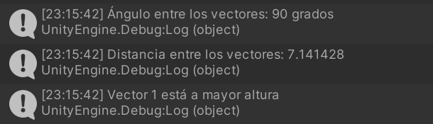
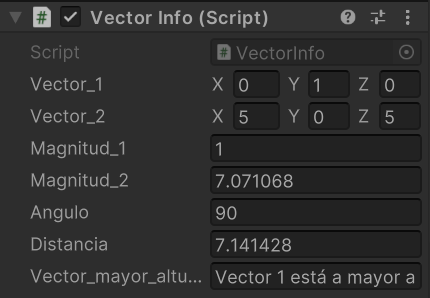

# Interfaces Inteligentes P02
## Ejercicio 1: ColorChanger
```cs
public class ColorChanger : MonoBehaviour {
  private Color color;
  public int frameDelay = 120;
  private int frameCounter;
```

```cs
  void Start() {
    ChangeRandomColor();
    ApplyColor();
  }
```

```cs
  void Update() {
    frameCounter++;
    if (frameCounter >= frameDelay) {
      frameCounter = 0;
      ChangeRandomColor();
      ApplyColor();
    }
  }
```

```cs
  void ChangeRandomColor() {
    color = new Color(Random.value, Random.value, Random.value, Random.value);
  }
```

```cs
  void ApplyColor() {
    Renderer renderer = GetComponent<Renderer>();
    if (renderer != null) {
      renderer.material.color = color;
    }
  }
}
```

## Ejercicio 2
```cs
void Start() {
  Debug.Log(gameObject.name);
}
```


## Ejercicio 3
```cs
public class VectorInfo : MonoBehaviour {
  public Vector3 vector_1, vector_2;
  public float magnitud_1, magnitud_2;
  public float angulo;
  public float distancia;
  public string vector_mayor_altura;
```
```cs
  void Start() {
    magnitud_1 = vector_1.magnitude;
    magnitud_2 = vector_2.magnitude;

    angulo = Vector3.Angle(vector_1, vector_2);
    distancia = Vector3.Distance(vector_1, vector_2);

    if (vector_1.y > vector_2.y) {
      vector_mayor_altura = "Vector 1 está a mayor altura";
    } else if (vector_1.y < vector_2.y) {
      vector_mayor_altura = "Vector 1 está a mayor altura";
    } else {
      vector_mayor_altura = "Ambos vectores están a la misma altura";
    }

    Debug.Log("Magnitud del vector 1: " + magnitud_1);
    Debug.Log("Magnitud del vector 2: " + magnitud_2);
    Debug.Log("Ángulo entre los vectores: " + angulo + " grados");
    Debug.Log("Distancia entre los vectores: " + distancia);
    Debug.Log(vector_mayor_altura);
  }
```
```cs
  void Update() {
    magnitud_1 = vector_1.magnitude;
    magnitud_2 = vector_2.magnitude;

    angulo = Vector3.Angle(vector_1, vector_2);
    distancia = Vector3.Distance(vector_1, vector_2);

    if (vector_1.y > vector_2.y) {
      vector_mayor_altura = "Vector 1 está a mayor altura";
    } else if (vector_1.y < vector_2.y) {
      vector_mayor_altura = "Vector 1 está a mayor altura";
    } else {
      vector_mayor_altura = "Ambos vectores están a la misma altura";
    }
  }
}
```



## Ejercicio 4
```cs
public class ShowPosition : MonoBehaviour {
  private Vector3 posicion;
  private GUIStyle estiloTexto;
```
```cs
void Start() {
  estiloTexto = new GUIStyle();
  estiloTexto.normal.textColor = Color.black;
}
```
```cs
void Update() {
  posicion = transform.position;
}
```
```cs
void OnGUI() {
  GUI.Label(new Rect(20, 20, 300, 40), "Posición de la Esfera: " + posicion, estiloTexto);
}
```

## Ejercicio 5
```cs
public class ObjDistances : MonoBehaviour {
  private GameObject cubo;
  private GameObject cilindro;
  private Transform transformCubo, transformCilindro, transformEsfera;
```
```cs
  void Start() {
    cubo = GameObject.FindWithTag("red_cube");
    cilindro = GameObject.FindWithTag("green_cylinder");

    transformCubo = cubo.GetComponent<Transform>();
    transformCilindro = cilindro.GetComponent<Transform>();
    transformEsfera = transform;

    float distanciaCubo = Vector3.Distance(transformEsfera.position, transformCubo.position);
    float distanciaCilindro = Vector3.Distance(transformEsfera.position, transformCilindro.position);

    Debug.Log("Distancia Esfera-Cubo: " + distanciaCubo);
    Debug.Log("Distancia Esfera-Cilindro: " + distanciaCilindro);
  }
```

## Ejercicio 6
```cs
public class Marcador : MonoBehaviour {
  public Vector3[] desplazamientos;
}
```
```cs
public class MoveObjects : MonoBehaviour {
    private Vector3 posicionOriginal;
    private Marcador marcador;
    public int indice;
    private Vector3 desplazamiento;
    private bool saltoPresionado = false;
```
```cs
void Start() {
  marcador = GameObject.Find("Marcador").GetComponent<Marcador>();

  if (indice >= 0 && indice < marcador.desplazamientos.Length) {
    desplazamiento = marcador.desplazamientos[indice];
  } else {
    Debug.LogWarning("Índice fuera de rango para el desplazamiento del objeto: " + gameObject.name);
  }
}
```
```cs
void Update() {
  float entradaSalto = Input.GetAxis("Jump");
        
  if (entradaSalto > 0 && !saltoPresionado) {
    Vector3 nuevaPosicion = transform.position + desplazamiento;
    transform.position = nuevaPosicion;
    saltoPresionado = true;    
  } else if (entradaSalto == 0) {
    saltoPresionado = false;
  }
}
```


## Ejercicio 7
```cs
public class ChangeColor : MonoBehaviour {
  private Renderer objRenderer;
```
```cs
void Start() {
  objRenderer = GetComponent<Renderer>();
}
```
```cs
void Update() {
  if (gameObject.CompareTag("green_cylinder") && Input.GetKeyDown(KeyCode.C)) {
    objRenderer.material.color = new Color(Random.value, Random.value, Random.value);
  }
  if (gameObject.CompareTag("red_cube") && Input.GetKeyDown(KeyCode.UpArrow)) {
    objRenderer.material.color = new Color(Random.value, Random.value, Random.value);
  }
}
```

## Ejercicio 8
```cs
public class ManageSpheres : MonoBehaviour {
  public GameObject cubo;
  private GameObject[] esferasTipo2;
  private Vector3 posicionCuboAnterior;
```
```cs
void Start() {
  esferasTipo2 = GameObject.FindGameObjectsWithTag("type2_sphere");
  posicionCuboAnterior = cubo.transform.position;
}
```
```cs
void Update() {
  if (esferasTipo2.Length == 0) return;

  if (cubo.transform.position != posicionCuboAnterior) {
    GameObject esferaMasCercana = ObtenerEsferaMasCercana(cubo.transform.position);
    if (esferaMasCercana != null) {
      Vector3 nuevaPos = esferaMasCercana.transform.position;
      nuevaPos.y += 0.1f;
      esferaMasCercana.transform.position = nuevaPos;
    }
    posicionCuboAnterior = cubo.transform.position;
  }

  if (Input.GetKeyDown(KeyCode.Space)) {
    GameObject esferaMasLejana = ObtenerEsferaMasLejana(cubo.transform.position);
    if  (esferaMasLejana != null) {
      Renderer renderer = esferaMasLejana.GetComponent<Renderer>();
      renderer.material.color = new Color(Random.value, Random.value, Random.value);
    }
  }
}
```
```cs
GameObject ObtenerEsferaMasCercana(Vector3 posicionCubo) {
  GameObject esferaMasCercana = null;
  float minDistancia = Mathf.Infinity;

  foreach (GameObject esfera in esferasTipo2) {
    float distancia = Vector3.Distance(posicionCubo, esfera.transform.position);
    if (distancia < minDistancia) {
      minDistancia = distancia;
      esferaMasCercana = esfera;
    }
  }
  return esferaMasCercana;
}
```
```cs
GameObject ObtenerEsferaMasLejana(Vector3 posicionCubo) {
  GameObject esferaMasLejana = null;
  float maxDistancia = 0f;

  foreach (GameObject esfera in esferasTipo2) {
    float distancia = Vector3.Distance(posicionCubo, esfera.transform.position);
    if (distancia > maxDistancia) {
      maxDistancia = distancia;
      esferaMasLejana = esfera;
    }
  }
  return esferaMasLejana;
}
```
.gif")
